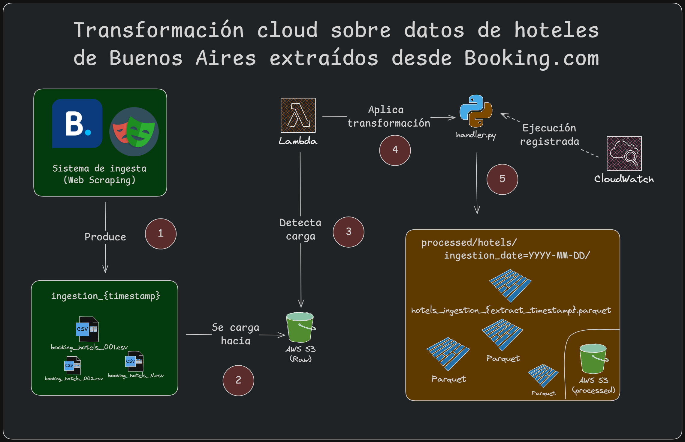

# Hotel Lakehouse Pipeline – Serverless Batch Processing on AWS

## Overview

Pipeline serverless de procesamiento batch para consolidación, validación y transformación de datos de hoteles ubicados en Buenos Aires. Este proyecto se puede pensar como "continuación" al proyecto que [implementa la capa de ingesta](https://github.com/Gerardo1909/booking-ba-scraper).

El sistema procesa múltiples archivos CSV agrupados por timestamp de ingesta, los consolida en un único archivo **Parquet particionado por fecha de ingesta**, y aplica reglas de calidad de datos antes de almacenarlos en un data lake en Amazon S3.

**Stack:** AWS Lambda · Amazon S3 · Pandas · PyArrow · Boto3 · Parquet · Python 3.13+

---

**Autor:** Gerardo Toboso · [gerardotoboso1909@gmail.com](mailto:gerardotoboso1909@gmail.com)

**Licencia:** MIT
